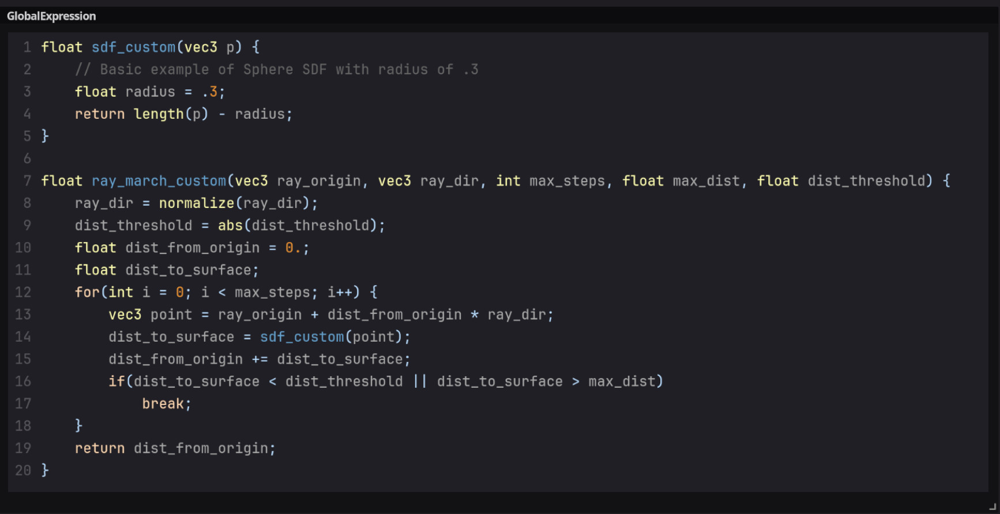
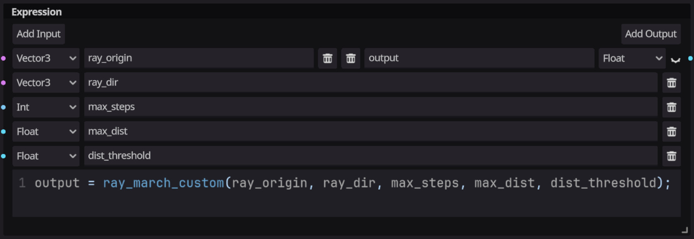

# Ray March node
A simple ray marcher for primitive shapes.

**Controls**
|Name|Options|Description|
|---|---|---|
|SDF (Signed Distance Function)|SDBox, SDSphere, SDCapsule, SDCylinder, SDTorus|Signed Distance Functions for the space to draw.|

**Inputs**
|Name|Type|Binding|Description|
|---|---|---|---|
|signed distance|float|none|Signed distance calculated from Signed Distance Functions (SDFs)|
|ray origin|vec3|none|Ray origin|
|ray direction|vec3|none|Normalized ray direction|
|max steps|int|none|Maximum number of steps for ray marching|
|max distance|float|none|Maximum distance to march along the <b><i>ray direction</i></b>|
|distance threshold|float|none|Threshold to check against <b><i>signed distance</i></b> to determine the ray intersection point.|

**SDFs Inputs**
|Name|Type|Availability|Description|
|---|---|---|---|
|cube pos|vec3|SDBox|Position offset of the box shape|
|cube eulers|vec3|SDBox|Rotation of the box shape in Degrees|
|cube scale|vec3|SDBox|Scale of the box shape|
|sphere pos|vec3|SDSphere|Position offset of the sphere shape|
|sphere eulers|vec3|SDSphere|Rotation of the box sphere in Degrees|
|sphere scale|vec3|SDSphere|Scale of the sphere shape|
|capsule pos|vec3|SDCapsule|Position offset of the capsule shape|
|capsule eulers|vec3|SDCapsule|Rotation of the capsule shape in Degrees|
|capsule height|float|SDCapsule|Height of the capsule shape|
|capsule radius|float|SDCapsule|Radius of the capsule shape|
|cylinder pos|vec3|SDCylinder|Position offset of the cylinder shape|
|cylinder eulers|vec3|SDCylinder|Rotation of the cylinder shape in Degrees|
|cylinder height|float|SDCylinder|Height of the cylinder shape|
|cylinder radius|float|SDCylinder|Radius of the cylinder shape|
|torus pos|vec3|SDTorus|Position offset of the torus shape|
|torus eulers|vec3|SDTorus|Rotation of the torus shape in Degrees|
|torus small radius|float|SDTorus|Small radius of the torus shape|
|torus big radius|float|SDTorus|Big radius of the torus shape|
  
**Outputs**
|Name|Type|Binding|Description|
|---|---|---|---|
|distance|float|None|Ray intersection distance|
___

**Extras**
This node is only simple ray marching example, the true power of raymarching can only be achieved by custom SDFs. At the moment I am unable to inject the custom code via visual shaders, so I have provided the custom template at the following location.  

The default location can be found at 
`res://addons/ShaderLib/RayMarching/RayMarchCustom.gdshaderinc`

You can copy the code from `RayMarchCustom.gdshaderinc` and then create a <b><i>Global Expression</i></b> node and paste it in your visual shader.  
  
Lastly you also need to create an <b><i>Expression</i></b> node, define required input and output parameters and call the custom ray marching function as below.  
 
___
